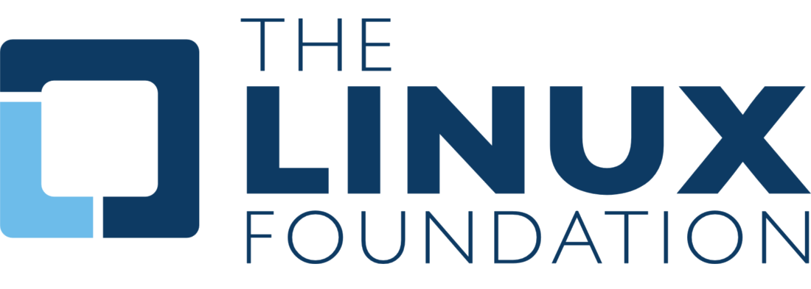
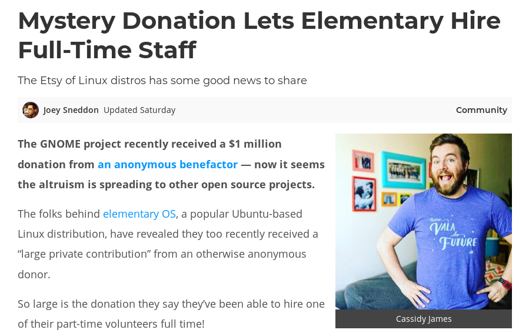
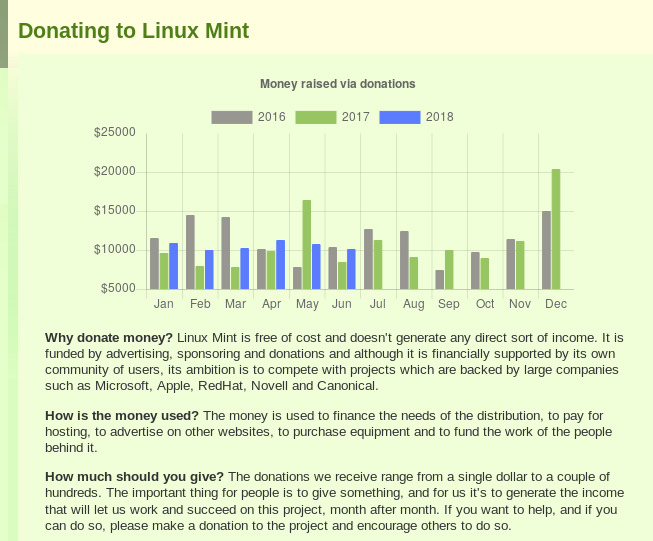
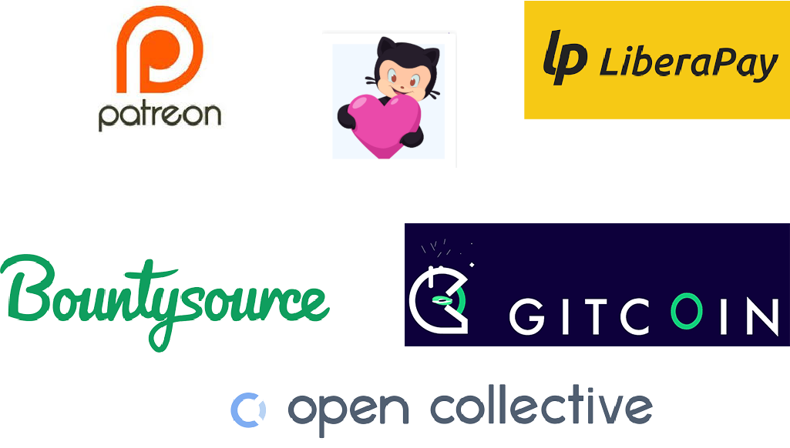
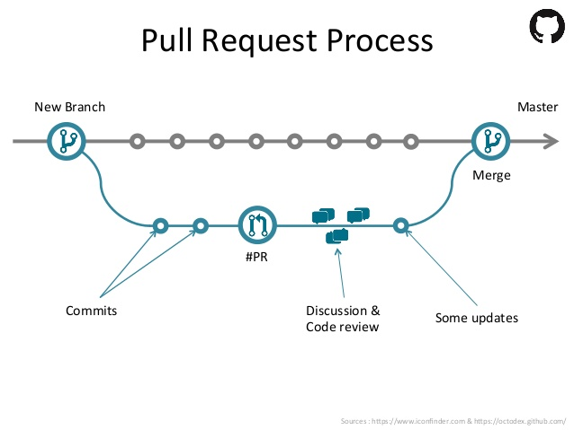

Desenvolvimento Aberto
===

# 

##### Fluxo de trabalho distribuído e Comunidades de Software

###### Igor dos Santos Montagner ( [igorsm1@insper.edu.br](mailto:igorsm1@insper.edu.br) )

---

# Aula 01

* Objetivos e motivações
* Fizemos uma primeira tentativa de PR para se adicionar ao repo da disciplina

---

# Hoje

### Expositiva

* Comunidades de software
* Fluxo de trabalho distribuído: modelo de Pull Request
	- `revert`
	- `rebase`
	- `ammend`

### Atividades

* Apresentação de projetos de software
* Revisar PR da aula anterior

---

# Comunidades de software

----
# Discussão

#

**Pergunta**: quais são os softwares que vocês mais utilizam no dia a dia?
#
#
#
**Pergunta 2**: quem é o principal desenvolvedor do projeto?

----

# Exemplo: Kernel Linux

Fundação dá suporte ao desenvolvimento do Kernel Linux e à criação de um ecossistema de software de código aberto ao seu redor.

Apoio:

* Financeiro
* Propriedade intelectual
* Infraestrutura
* Serviços e treinamento

---
# Exemplo: Kernel Linux

Empresas que patrocinam desenvolvimento:

1. Intel (13.1%)
2. Indivíduos (8.2 %)
3. Red Hat (7.2%)
4. Linaro (5.6%)
5. Desconhecido (4.1%)
6. IBM (4.1%)
7. Consultores (3.3%)
8. Samsung (3.2%)
9. SUSE (3.0%)
10. Google (2.7%)

Fonte: "2017 Linux Kernel Development Report"

---
# Exemplo: Ubuntu

#
#

#
#

Empresa privada controla o desenvolvimento do Ubuntu. Obtem recursos via

* Doações
* Serviços de desenvolvimento e consultoria
* Treinamento

---
# Exemplo: Gitlab

#
#

#
# 

Empresa financiada até agora por VC (Venture Capital) em busca de lucro. 

* Opção de planos grátis com software de código aberto
* Opção de planos corporativos com mais funcionalidades e **suporte**
* Instalações locais

---
# Exemplo: Elementary

#

#

Distribuição linux comandada por uma empresa "minúscula" focada em experiência de usuário. Recursos são obtidos via

* Doações
* Compras na loja AppCenter

---

---

# Exemplo: Linux Mint

#

Distribuição linux cujo objetivo é que tudo funcione direto na instalação. É considerada boa para iniciantes. 

---	

---

----

---

# Outras fontes

Diversas outras maneiras de conseguir suporte e financiamento

---
# Razões para financiar (empresa)
#
- "Adquirir" especialistas em uma tecnologia
- Vender suporte ou consultoria
- Marketing
- Licença de software "obriga" 
#
#

Nem sempre o que é financiado termina em um formato "aproveitável" por terceiros (ex: Android/Linux, TiVO)

---
# Razões para contribuir (indivíduo)

- Profissionais
	- Reputação / Currículo
	- Necessidade de negócio
- Pessoais
	- Altruísmo / Ideologia
	- Sensação de realização pessoal
	- Exercício de criatividade
	- Resolver um problema de seu interesse

---
# Como começar a contribuir?

---
# Atividade: Explorando o entorno de um projeto

* Pesquisar como as comunidades de alguns projetos estão organizadas
* Produzir uma apresentação resumindo suas descobertas

#

## Limite: 18:50
-----

# Fluxo de trabalho

### Sistemas de controle de versão distribuídos

-----

# Modelo 1: Pull Request

  Fonte: https://www.slideshare.net/abderrahmanebenbachir/continuous-integration-in-github 

---

# Modelo 1: Pull Request

  Fonte: https://www.slideshare.net/abderrahmanebenbachir/continuous-integration-in-github 

---
# Fluxo de Trabalho: outros modelos

1. Enviar patch via lista de e-mails (ex. Linux)
2. Ferramentas de *code review* (ex. KDE - Phabricator)
3. Patch é anexado no Bug Tracker (ex. Haiku, KDE)
4. Não recebe contribuições externas

----

# Revisão dos PRs da aula passada

## Erros comuns

---

# Erro 1: arquivos extras no PR

**Erro**: modificar arquivos não relacionados a sua mudança proposta.

#

**Ideal**: 

1. Um Pull Request deverá conter o somente os arquivos relacionados a modificação proposta. 
1. Cada modificação proposta está em um Pull Request separado

----

---

# Erro 1: arquivos extras no PR

**Como consertar**: `git revert` cria um commit que desfaz alterações anteriores.

.svg?cdnVersion=501)

**Opções extras**:

* `--no-commit`: só adiciona as modificações, mas não faz o commit. Permite desfazer parcialmente um commit. 

Fonte: https://www.atlassian.com/git/tutorials/

----

# Erro 2: PR contém mais de um commit

**Erro**: o PR está espalhado em vários commits. 

#

**Ideal**: 

1. Colocar toda sua modificação em um só commit ajuda a entender o que foi modificado no PR.
1. Mantém histórico limpo, com um commit por bug consertado ou funcionalidade adicionada.
1. Facilita encontrar erros e desfazer a modificação caso ela seja problemática (usando `git revert')

---

# Erro 2: PR contém mais de um commit

----

# Erro 2: PR contém mais de um commit

**Como consertar**: `git rebase -i master` permite remover e juntar commits do branch atual que não estejam no `master`. 

Fonte: https://www.atlassian.com/git/tutorials/

----
# Erro 3: Mensagens de commit não descritivas

**Como consertar**: `git commit --amend` permite modificar o último commit feito. 

---

# Atividade

## corrigir seu PR e cumprir a última parte do roteiro da última aula.

------------

<!---

# Minha primeira contribuição de código

* Projetos e issues pré-selecionados
* Será feita em duplas duas vezes
	* cada vez um será o responsável
	* ajudar a desempacar
* Teremos 2 aulas dedicadas para esta primeira contribuição

----

# Pandas 

Biblioteca de tratamento de dados usada em Ciência dos Dados. 

* Projeto complexo, com muitos casos de uso especiais
* Toneladas de funcionalidades de visualização textual e gráfica de dados

Qual seria nosso [impacto](https://github.com/pandas-dev/pandas/graphs/contributors)?

----

# Pandas (Issues)

### Formatação

* [[1]](https://github.com/pandas-dev/pandas/issues/27563), [[2]](https://github.com/pandas-dev/pandas/issues/13257), [[3]](https://github.com/pandas-dev/pandas/issues/25955)

### Pré-processamento

* [[1]](https://github.com/pandas-dev/pandas/issues/13628), [[2]](https://github.com/pandas-dev/pandas/issues/18198), [[3]](https://github.com/pandas-dev/pandas/issues/16698)

### Entrada/saída:

* [[1]](https://github.com/pandas-dev/pandas/issues/26692), [[2]](https://github.com/pandas-dev/pandas/issues/22853)

### Visualização

* [[1]](https://github.com/pandas-dev/pandas/issues/14119)

---

# Sphinx

Projeto para documentação de projetos. Usado para documentar o próprio Python.

* Trabalha com textos em diversos formatos
* Faz referência entre documentos e com código fonte.

[Nosso impacto](https://github.com/sphinx-doc/sphinx/graphs/contributors)

---

# Sphinx (issues)

### Exemplos

* [[1]](https://github.com/sphinx-doc/sphinx/issues/4731) 

### Documentos e formatação

* [[1]](https://github.com/sphinx-doc/sphinx/issues/6241) [[2]](https://github.com/sphinx-doc/sphinx/issues/6094) [[3]](https://github.com/sphinx-doc/sphinx/issues/4925)

---

# Outros projetos

1. Electron (tecnologias web para criar programas Desktop)
2. Godot engine (motor de jogos + editor)
3. Nikola (gerador de sites estáticos)

----

# Outras fontes de projetos

* https://github.com/MunGell/awesome-for-beginners
* https://www.codetriage.com/
* https://up-for-grabs.net/#/
* http://github-help-wanted.com/

Sugestões: Marcelo e Gustavo (turma 1)

----

# Como procurar

Bons projetos usam tags para facilitar a recepção de novatos

* good-first-issue
* newcomers
* help wanted
* low effort
* difficulty novice
* easy

--->

# 

##### Comunidades de software

